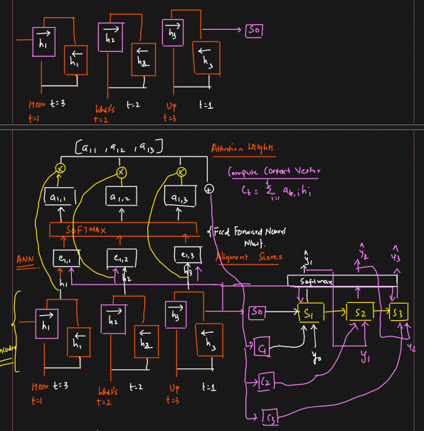

# 🟢 Attention Mechanism - Seq2Seq

* The idea is that for longer sentence we will pass context vector and additional context as well
* <mark style="color:purple;background-color:purple;">**From encoder we get hidden state - S0 and C - Context vector**</mark>
*

    <figure><figcaption></figcaption></figure>
* **Attention Mechanism:**
* In the encoder, we will be using bi directional LSTM
* In 1st RNN data will go t1 to t3 and in 2nd it will go t3 to t1
* The outputs of both the RNNs will be combined
* <mark style="color:purple;background-color:purple;">**S0 is the hidden state**</mark>
* <mark style="color:purple;background-color:purple;">**h1, h2, h3 will be output, we will convert it into some context and then give it to the decoder**</mark>
* <mark style="color:red;background-color:purple;">**The idea is to create a new context vector every timestep on the decoder which attends differently to the encoded sequence**</mark>
* <mark style="color:purple;background-color:purple;">**We will pass h1 and S0, h2 and S0 and h3 and S0 to get e11, e12, e13 ⇒ Alignment scores**</mark>
* <mark style="color:purple;background-color:purple;">**Then we pass it to softmax ANN**</mark>
* <mark style="color:purple;background-color:purple;">**This will give us a11, a12 and a13 ⇒ This decides how much context vector of each output to be taken**</mark>
* <mark style="color:purple;background-color:purple;">**We multiply this weights with hidden states ... to get attention scores**</mark>
* <mark style="color:purple;background-color:purple;">**We will take summation of this to get context vector**</mark>
* In decoder we will give y0, S0 and C1 and we will get ypred
* From S1 we need to pass information from S1 to S2
* <mark style="color:purple;background-color:purple;">**Now for S2, we will take the hidden state of S1 and pass it to get e and so on, this will give us C2**</mark>
* <mark style="color:purple;background-color:purple;">**This will continue for the remaining time stamp**</mark>
*

    <figure><figcaption></figcaption></figure>
