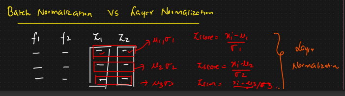
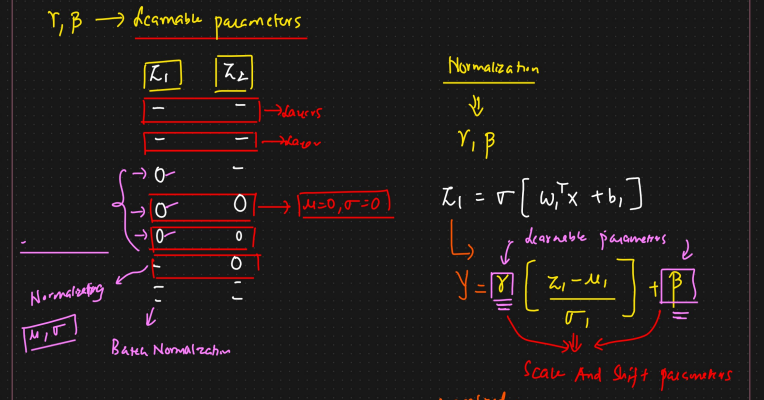

# Batch Normalization vs Layer Normalization

* &#x20;In Layer normalization, we take layer by layer and then normalize it
*

    <figure><figcaption></figcaption></figure>
* There are 2 learnable parameters, gamma and beta
* In Batch normalization ⇒  If Z1 or Z2 contains lots of 0s, if we normalize using it then due to this 0s all the values will be impacted
* In Layer normalization, it won't have much impact
* After calculation Z, we will use gamma and betta
* If our distribution is not important, and we do not want to normalize it, then it can be controlled using gamma
*   Gamma and beta are also known as scale and shift parameters

    <figure><figcaption></figcaption></figure>
