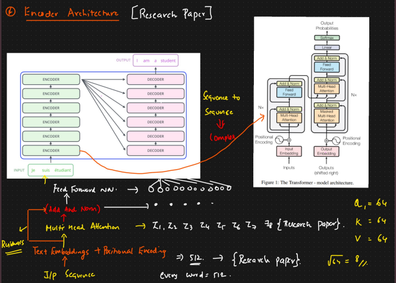
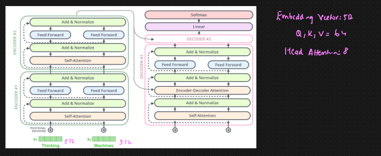

# Complete Encoder Transformer Architecture

* As per the research paper, there are 6 encoders and 6 decoders
* Every word will have dimension of 512, same will be positional embedding
* In self attention, we have important parameters ⇒ Q, V, K ⇒ dimension of 64

**Steps:**

* Input sequence ⇒ Embedding + Positional Embedding&#x20;
* Multi Head Attention (8 Heads)
* Add and Normalize (Layer Normalize) ⇒ This is basically called as Residuals
* Feed forward NN&#x20;
*

    <figure><figcaption></figcaption></figure>
*

    <figure><figcaption></figcaption></figure>
