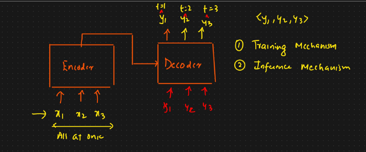

# 🟢 Decoder in Transformer

* Responsible for <mark style="color:purple;background-color:purple;">**generating the output sequence one token at a time, using the encoders output and the previously generated tokens**</mark>
* <mark style="color:purple;background-color:purple;">**3 important components**</mark>
  * <mark style="color:purple;background-color:purple;">**Masked multi head self attention**</mark>
  * <mark style="color:purple;background-color:purple;">**Multi head attention (Encoder Decoder Attention)**</mark>
  * <mark style="color:purple;background-color:purple;">**Feed forward NN**</mark>
* Output of encoder ⇒ Multi head attention of encoder
*

    <figure><figcaption></figcaption></figure>
* In Encoder, we will be passing all the input at once
* In Decoder, output will be generated at each time stamp one by one token
*   <mark style="color:purple;background-color:purple;">**In training, we will be giving actual output to the decoder**</mark>

    <figure><figcaption></figcaption></figure>
