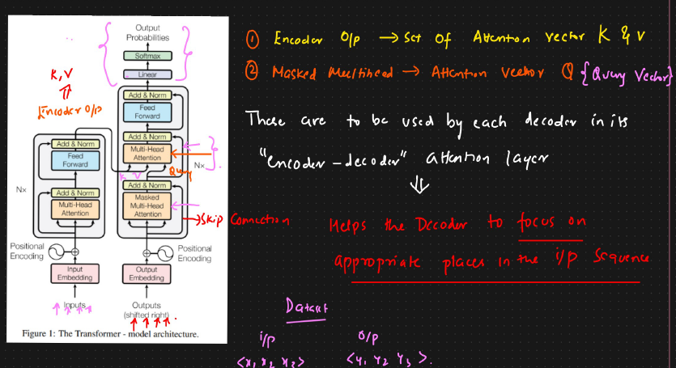

# Encoder Decoder Multi Head Attention

* After masked multi head attention, layer normalization will happen
* 2 of the connections from encoder are coming here
* From encoder we are taking Attention vectors of keys and values
* From the add and norm of decoder, we will be passing Attention query vector here
* These will be used by each decoder in its "encoder-decoder" attention layer
* This helps the decoder, to focus on appropriate places in the input sequence
*

    <figure><figcaption></figcaption></figure>
