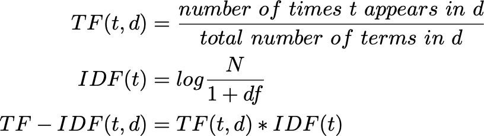

# 🟢 Final Decoder Linear and Softmax Layer

* <mark style="color:purple;background-color:purple;">**The linear layer is a simple fully connected NN that projected the vector the vector produced by the stack of decoder**</mark>
* <mark style="color:purple;background-color:purple;">**It generates logits**</mark>
* <mark style="color:purple;background-color:purple;">**Softmax turns these scores into probabilities**</mark>
* <mark style="color:purple;background-color:purple;">**The cell with the highest probability is chosen as output and the word associated with it is produced as the output**</mark>
*

    <figure><figcaption></figcaption></figure>
