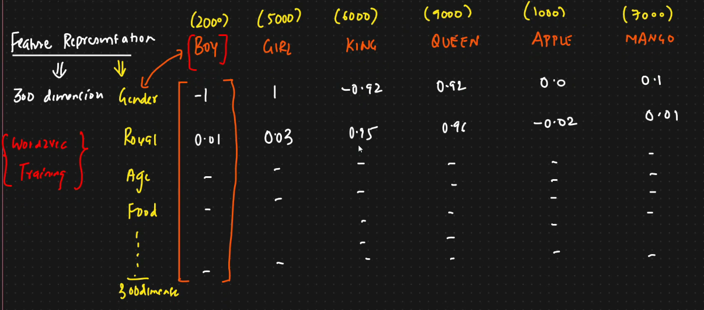
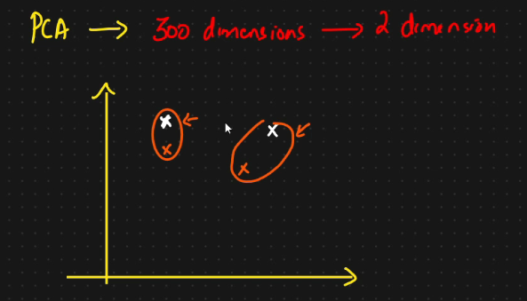

# ✈️ Getting started with embedding layers

* Word embedding (Feature Representation)
* <mark style="color:purple;background-color:purple;">**Important parameters for this are vocabulary size and dimensions**</mark>
* Dataset
  * Text                             Output
  * \<x11 x12 x13 x14 >         0
* word2vec is a type of word embedding and can also be used in embedding layer
* <mark style="color:purple;background-color:purple;">**Lets say we have few words and there index, with a vocabulary of 10000**</mark>
* <mark style="color:purple;background-color:purple;">**For all the words we will select some feature representation, n which we will take every word and represent in some dimension(lets say 300)**</mark>
* <mark style="color:purple;background-color:purple;">**So the word boy will be converted into vector using the relation between boy and all the 300 features**</mark>
* <mark style="color:purple;background-color:purple;">**So using this we will be getting vectors for the word**</mark>
*

    <figure><figcaption></figcaption></figure>
* If we convert this 300 into 2 dimension using PCA and plot it, we will get something like below
* Similar words will be grouped together
* We can use cosine similarity to find the distance between them
* Recommendation engine makes use of it
*

    <figure><figcaption></figcaption></figure>
*
