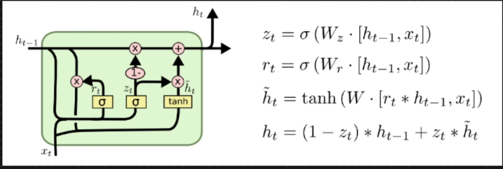

# 🟢 GRU RNN

* 2014
* In LSTM we have separate long term memory and short term memory
* <mark style="color:purple;background-color:purple;">**If higher accuracy needed then go for LSTM**</mark>
* <mark style="color:purple;background-color:purple;">**LSTM architecture is complex**</mark>, as we are using 3 different gates and candidate memory as well. so there are 3 important weight Wf, Wi and Wo
* <mark style="color:purple;">**So the trainable parameters is high**</mark>
* So training time will also increase
* <mark style="color:purple;background-color:purple;">**Short term and long term memory have been combined ⇒ In GRU**</mark>
* <mark style="color:purple;background-color:purple;">**Zt is called as update gate**</mark>
* <mark style="color:purple;background-color:purple;">**Rt is called as reset gate**</mark>
* <mark style="color:purple;background-color:purple;">**Xt and Ht-1 is passed to get Rt and Zt**</mark>
* <mark style="color:purple;background-color:purple;">**Rt is done point wise operation with Ht-1**</mark>
*   <mark style="color:purple;background-color:purple;">**Reset gate (r) → controls how much past memory to forget when creating the candidate hidden state.**</mark>

    * <mark style="color:purple;background-color:purple;">**If rt is close to 0 → most of the past info is ignored.**</mark>
    * <mark style="color:purple;background-color:purple;">**If rt​ is close to 1 → past info is fully used in candidate.**</mark>

    <mark style="color:purple;background-color:purple;">**Update gate (z) → controls how much new memory to add vs how much old memory to keep.**</mark>

    * <mark style="color:purple;background-color:purple;">**If zt​ is close to 0 → keep old memory (little update).**</mark>
    * <mark style="color:purple;background-color:purple;">**If zt​ is close to 1 → replace with new memory (large update).**</mark>
* H\~t is called as temporary hidden state
* Rt is done point wise operation with Ht-1 and this is send to tanh to get temporary hidden state
* This is done pointwise operation with Zt and it is again done point wise operation we update Ht
* We subtract some information with Ht-1
*

    <figure><figcaption></figcaption></figure>
* Reset Gate: Will be responsible in resetting some information from Ht-1
* Update Gate: What context info needs to be added
* To update ht, using (1 - Zt )\* ht we will remove context and using Zt\*Ht we will add context
