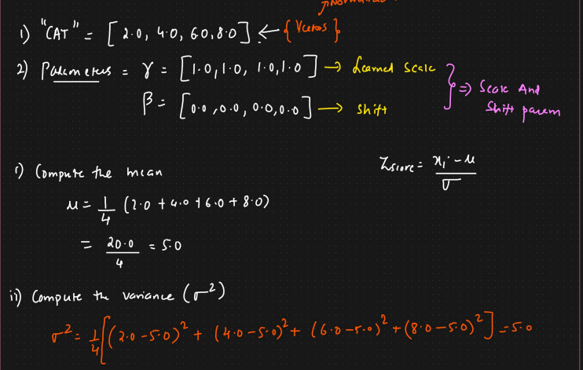
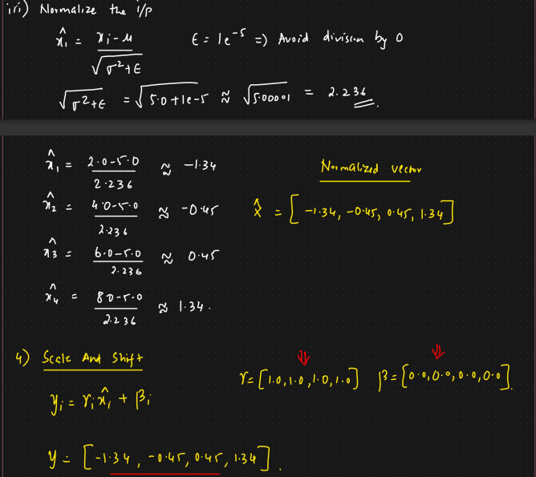

# Layer Normalization Example

* &#x20;Gamma is scale parameter
* Beta is shift parameter

**Steps:**

* Compute the mean
* Compute the variance
* Normalize the input
*   Scale and shift

    <figure><figcaption></figcaption></figure>
* &#x20;
*

    <figure><figcaption></figcaption></figure>
