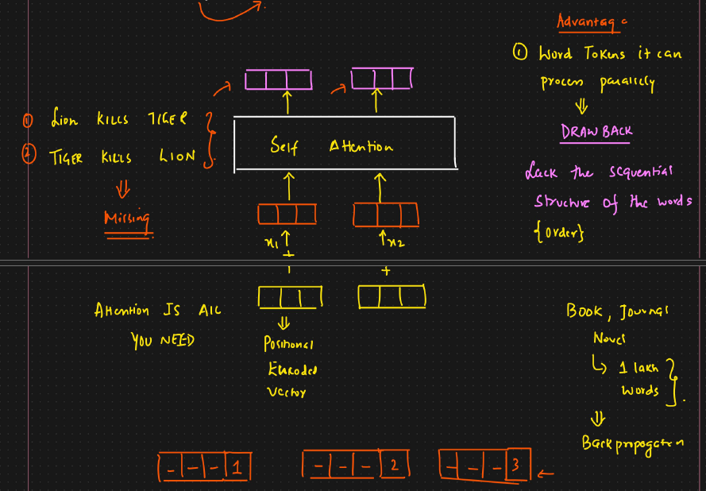
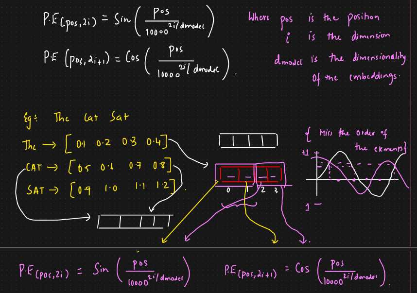
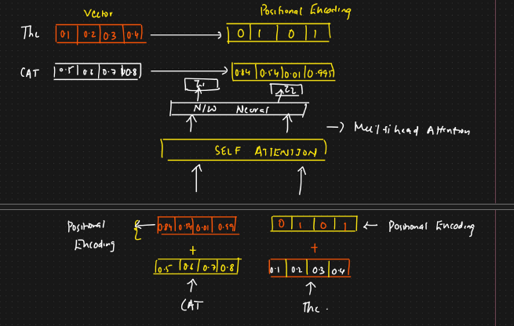

# 🟢 Positional Encoding

* Representing order of sequence
* <mark style="color:purple;background-color:purple;">**Major advantage of using transformer is that it can process all the word tokens parallelly but it lacks the sequential structure of the words**</mark>
* Example:
  * Lion kills tiger
  * Tiger kills lion
  * If we don't pass order, both sentence will return same vector
* To resolve this we use, positional encoding
*

    <figure><figcaption></figcaption></figure>
* As per the paper - Attention is all you need - Along with embedding vector, we will create positional encoded vector
* This positional encoded vector will be added with encoded vector ⇒ This vector will be responsible for telling which word is at which position
* For large text, the number of words will be very large
* <mark style="color:purple;background-color:purple;">**Added only to encoder 1, output of encoder 1 will be propagated to subsequent encoders**</mark>

**Types of Position encoding**&#x20;

1. Sinusoidal Position Encoding:

* <mark style="color:purple;background-color:purple;">**It uses sine and cosine function of different frequencies to create positional encodings**</mark>
* <mark style="color:purple;background-color:purple;">**Even indices → sine , Odd indices → cosine**</mark>
*   <mark style="color:purple;background-color:purple;">**It's length will be same as token embedding, so that they can be added**</mark>

    <figure><figcaption></figcaption></figure>

    <figure><figcaption></figcaption></figure>
*

    <figure><figcaption></figcaption></figure>

2. Learned Position Encoding: Learned during training
