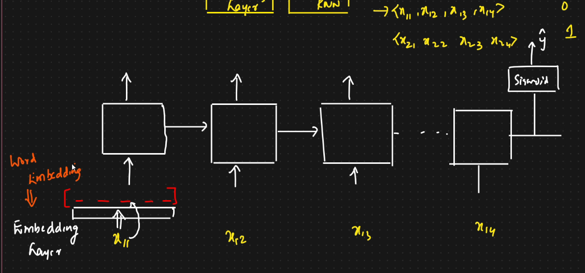

# 🟢 Problem Statement

* <mark style="color:purple;background-color:purple;">**Sentiment Analysis of IMDB Reviews**</mark>
* IMDB dataset
  * Reviews       Output (Positive/Negative)
* Using simple RNN
* Dataset ⇒ Feature Extraction ⇒ Simple RNN ⇒ Save the model in .h5 file ⇒ Streamlit web app ⇒ Deployment
* We also need to use embedding layer here
* <mark style="color:purple;background-color:purple;">**Embedding Layer: To convert words into vectors with some dimensions**</mark>
*

    <figure><figcaption></figcaption></figure>
