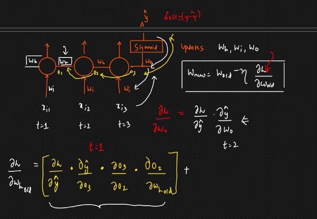
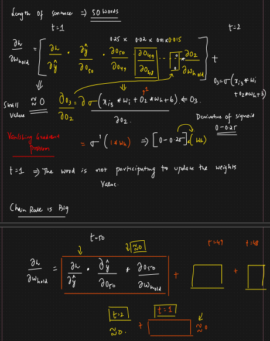

# 🔴 Problems with RNN

<mark style="color:purple;background-color:purple;">**Vanishing Gradient Problem**</mark>

* In ANN, we faced vanishing gradient problem, same problem we can face in RNN as well
* If we are working on a text generation problem, so the word will be predicted based on the previous words
* We can say it has short term dependencies on previous words
* if we have a long sentence, then the dependency can be on any word
* If a sentence has 100 words, then at t = 100 we will calculate back propagation
*

    <figure><figcaption></figcaption></figure>
* <mark style="color:purple;background-color:purple;">**The long term dependency cannot be captured by RNN**</mark>&#x20;
* If the length is 3
*   For updating weight Wh, in gradient calculation we need to add for 3 time stamps

    <figure><figcaption></figcaption></figure>
* <mark style="color:purple;background-color:purple;">**If the length is 50**</mark>
* <mark style="color:purple;background-color:purple;">**The derivative of sigmoid is between 0 and 0.25**</mark>
* <mark style="color:purple;background-color:purple;">**So when we multiply this small terms the gradient will almost be 0, so we can say that the word is not participating in weight updation**</mark>
* <mark style="color:purple;background-color:purple;">**The words which are nearer to the output they will contribute in weight updation**</mark>
*   <mark style="color:purple;background-color:purple;">**And the weights wont be updated**</mark>

    <figure><figcaption></figcaption></figure>
* <mark style="color:purple;background-color:purple;">**To solve this we can also other activation functions like ReLU, Leaky ReLU**</mark>
* <mark style="color:purple;background-color:purple;">**Another option is to use LSTM**</mark>
