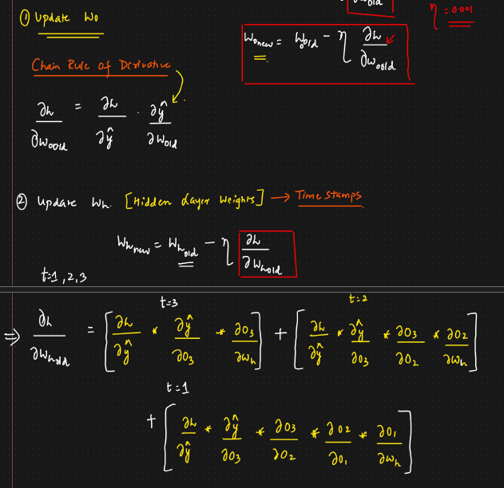

# Simple RNN Backward Propagation

* We will be passing xi1 at t = 1
* Initially some weights will be assigned
* O0 can be initialized as zero or any random value
* Using forward pass we will get O1, O2....O4
* O4 will be passed to sigmoid (If binary classifier)
* To reduce the loss, we need to update the weights (Wi, Wh, W0) using the weight updation formula
*

    <figure><figcaption></figcaption></figure>
* Update weight:
* W0 is directly dependent of ypred and ypred is direct dependent on loss
* Wh is used in each and every time stamp
* We have to find Wh based on all the timestamps
*
*

    <figure><figcaption></figcaption></figure>
*

    <figure><figcaption></figcaption></figure>
