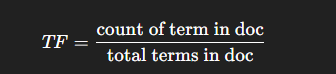

# 🟢 TF-IDF

* <mark style="color:purple;background-color:purple;">**Less importance to words which is occurring in all the documents**</mark>
* <mark style="color:purple;background-color:purple;">**More importance to words which occur rarely**</mark>
*

    <figure><figcaption></figcaption></figure>

#### Documents

* **Doc1**: "the cat sat on the mat"
* **Doc2**: "the dog sat on the log"
* **Doc3**: "the cat chased the dog"

***

#### Step 1: Vocabulary

Unique terms = {the, cat, sat, on, mat, dog, log, chased}

***

#### Step 2: Term Frequency (TF)

Formula:

<figure><figcaption></figcaption></figure>

| Term   | Doc1 count | TF (Doc1)   | Doc2 count | TF (Doc2)   | Doc3 count | TF (Doc3) |
| ------ | ---------- | ----------- | ---------- | ----------- | ---------- | --------- |
| the    | 2          | 2/6 = 0.333 | 2          | 2/6 = 0.333 | 2          | 2/5 = 0.4 |
| cat    | 1          | 1/6 = 0.167 | 0          | 0           | 1          | 1/5 = 0.2 |
| sat    | 1          | 0.167       | 1          | 0.167       | 0          | 0         |
| on     | 1          | 0.167       | 1          | 0.167       | 0          | 0         |
| mat    | 1          | 0.167       | 0          | 0           | 0          | 0         |
| dog    | 0          | 0           | 1          | 0.167       | 1          | 0.2       |
| log    | 0          | 0           | 1          | 0.167       | 0          | 0         |
| chased | 0          | 0           | 0          | 0           | 1          | 0.2       |

***

#### Step 3: Inverse Document Frequency (IDF)

Formula:

<figure><figcaption></figcaption></figure>

where **N = 3 docs**, **df = number of docs containing the term**

| Term   | df | IDF = log10(3/df)  |
| ------ | -- | ------------------ |
| the    | 3  | log10(3/3) = 0     |
| cat    | 2  | log10(3/2) = 0.176 |
| sat    | 2  | 0.176              |
| on     | 2  | 0.176              |
| mat    | 1  | 0.477              |
| dog    | 2  | 0.176              |
| log    | 1  | 0.477              |
| chased | 1  | 0.477              |

***

#### Step 4: TF–IDF = TF × IDF

| Term   | TF–IDF (Doc1)         | TF–IDF (Doc2)         | TF–IDF (Doc3)       |
| ------ | --------------------- | --------------------- | ------------------- |
| the    | 0.333 × 0 = 0         | 0.333 × 0 = 0         | 0.4 × 0 = 0         |
| cat    | 0.167 × 0.176 = 0.029 | 0                     | 0.2 × 0.176 = 0.035 |
| sat    | 0.167 × 0.176 = 0.029 | 0.167 × 0.176 = 0.029 | 0                   |
| on     | 0.167 × 0.176 = 0.029 | 0.167 × 0.176 = 0.029 | 0                   |
| mat    | 0.167 × 0.477 = 0.080 | 0                     | 0                   |
| dog    | 0                     | 0.167 × 0.176 = 0.029 | 0.2 × 0.176 = 0.035 |
| log    | 0                     | 0.167 × 0.477 = 0.080 | 0                   |
| chased | 0                     | 0                     | 0.2 × 0.477 = 0.095 |

***

#### Step 5: Final TF–IDF Matrix

* Vocabulary order (columns): **\[the, cat, sat, on, mat, dog, log, chased]**

| Document |   the |   cat |   sat |    on |   mat |   dog |   log | chased |
| -------- | ----: | ----: | ----: | ----: | ----: | ----: | ----: | -----: |
| Doc1     | 0.000 | 0.029 | 0.029 | 0.029 | 0.080 | 0.000 | 0.000 |  0.000 |
| Doc2     | 0.000 | 0.000 | 0.029 | 0.029 | 0.000 | 0.029 | 0.080 |  0.000 |
| Doc3     | 0.000 | 0.035 | 0.000 | 0.000 | 0.000 | 0.035 | 0.000 |  0.095 |

* As row vectors (same order as vocabulary):
  * **Doc1:** \[0.000, 0.029, 0.029, 0.029, 0.080, 0.000, 0.000, 0.000]
  * **Doc2:** \[0.000, 0.000, 0.029, 0.029, 0.000, 0.029, 0.080, 0.000]
  * **Doc3:** \[0.000, 0.035, 0.000, 0.000, 0.000, 0.035, 0.000, 0.095]
