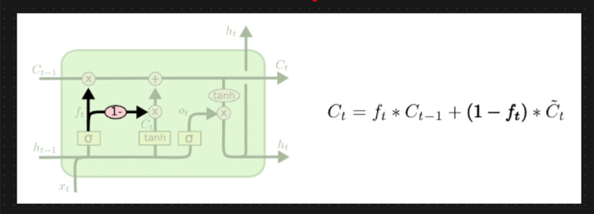

# ✈️ Variant of LSTM

* Here we are coupling forget and input gates
* Instead of separately deciding what to forget and what we should add new information
* We make this decision together&#x20;
* The goal is that we only forget when we are going to input something in its place
* We only input new values to the state when the state when we forget something older
*

    <figure><figcaption></figcaption></figure>
