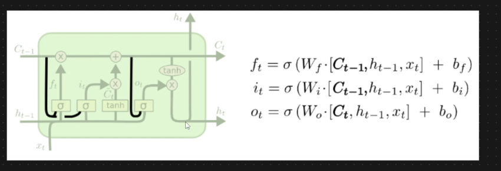

# 🟢 Variants of LSTM RNN - Peephole

* Introduced by Gers and Schmidhuber in 2000
* <mark style="color:red;background-color:purple;">**Ct-1 has been passed to Input gate and forget gate**</mark>
* <mark style="color:red;background-color:purple;">**Ct has been passed to output gate**</mark>
* <mark style="color:red;background-color:purple;">**This connections are known as Peephole connections**</mark>
*

    <figure><figcaption></figcaption></figure>

**Peephole Connection:**&#x20;

* Through this architecture we let the gate layers look at the cell state
* It means <mark style="color:purple;background-color:purple;">**we are also letting it look at the memory and then decide what to forget and what to add**</mark>
* This probably gives better results
